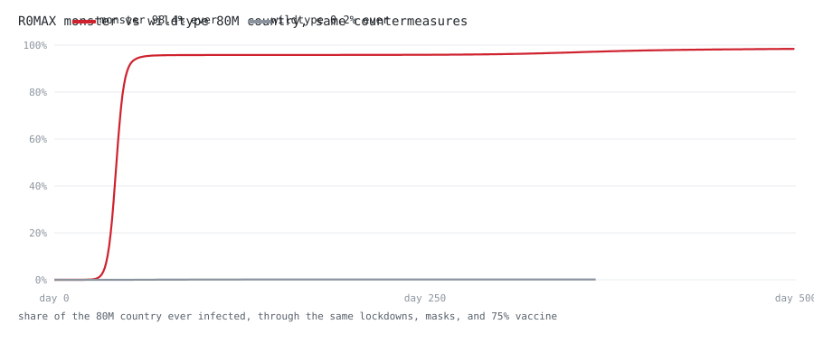
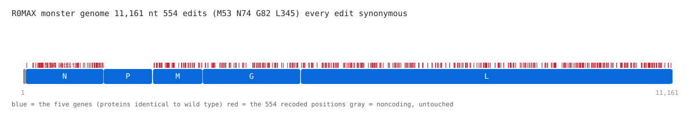

# R0MAX

**A virus, designed entirely in code.**

Built on a real virus backbone. Evolved inside a simulated country of 80 million people. Verified letter by letter. Shipped with a full lab order package, ready to be made for real.

---

## What it is

A recoded **Vesicular stomatitis virus (VSV)** genome.

VSV is a standard, safe lab virus (BSL-2, the same level as a regular flu lab). We kept its exact same five proteins and only changed the way the genes are written. Same meaning, new spelling, letter by letter.

So it is a **recoded strain**. Same virus. Same proteins. New code.

## Why

One word: **spread**.

We evolved the genome in a simulated country of 80 million people, pushing for one thing: maximum **R0** (how many people each infected person infects) with a 1918-style low kill rate.

Spread fast. Barely kill. Never burn out.

## The five numbers

**R0 = 7.96.** The evolved monster. Seasonal flu is 1.3. The 1918 flu was ~1.8. Measles is 15.

**98.4%.** How much of the simulated country it took over, through the same lockdowns, masks, and a 75% vaccine that easily contained the normal version.

**11,161 nt.** The full genome, real VSV backbone, same length as wild type.

**554.** Total edits: M 53, N 74, G 82, L 345.

**5.** Proteins. Every one identical to wild type. Verified.

## Monster vs normal

Same country. Same lockdowns. Same masks. Same 75% vaccine.

| Version | Result |
|---|---|
| Normal (wild type) | 0.2% infected. Contained. |
| **Monster** | **98.4% infected. Owns the country.** |



## The monster genome



## Run it

```
python3 run.py
```

Runs the whole story: the wildtype, the evolution, the monster, the fight, the acceptance checks. No dependencies. Just Python 3.

```
python3 design.py
```

Builds the actual genome from the wild type backbone, verifies every edit is safe (synonymous, same proteins), and writes the lab order files.

## What is in here

```
genome.py      the 8-lever genome + fitness model
country.py     the 80M country simulation + countermeasures
evolve.py      the evolution loop
run.py         the whole story end to end
design.py      the sequence-level builder
monster.fa     the recoded genome, 11,161 nt
vsv_j02428.fa  the wild type backbone (NCBI J02428)
order/         the full lab order package
docs/          the design doc
```

## Is this safe?

Yes.

VSV is a standard BSL-2 lab virus. This is a recoded strain: same five proteins as the parent strain, every edit synonymous. It is not a new kind of virus. It is the same virus, written differently. No special licensing needed.

## The lab order

Everything needed to get it made is in `order/`:

- **a) Full-length clone** (gene synthesis company): the whole 11,161 nt genome, one piece, in a low-copy plasmid, under a T7 promoter, flanked by a hammerhead ribozyme at the start and an HDV ribozyme at the end.
- **b) Helper plasmids** (same companies): wild type N, P, L, one gene per plasmid.
- **c) Rescue brief** (the lab that makes it live): co-transfect the 4 plasmids into a T7 cell line, wait 2 to 6 days, harvest, confirm 11,161 nt + 5 proteins == wild type.

Total cost estimate: **$2,500 to $15,000**. Total time: **3 to 8 weeks**.